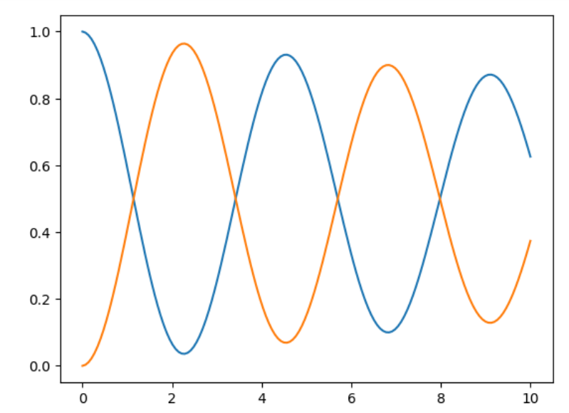

#Tutorial

#Se muestra el uso de las funciones para el siguiente ejemplo:
    
    
    #Definir variable compleja
    iConst = 1.0j

    #Definir el operador a utilizar
    oOper = np.array([[0, 1], [1, 0]])

    #Es necesario definir un estado inicial
    yInit = np.array([[1, 0], [0, 0]])

    #se utiliza la funcion np.linspace para crear un arreglo de valores temporales 
    times=np.linspace(0,10,150)

    #variable que contiene el paso temporal
    h= times[1]-times[0]

    # Se inicializa dos arreglos que van a contener los valores con valores iniciales cero. Utilizamos el mismo tamaño del arreglo que contiene la variable independiente temporal: 
    stateQuant00 = np.zeros(times.size)
    stateQuant11 = np.zeros(times.size)

    #  Esta rutina realiza la evolución temporal
    for tt in range(times.size):
        # Se guarda el valor de las entradas (0,0) y (1,1) en los arreglos que se definieron 
        stateQuant00[tt] = np.real(yInit[0,0]) 
        stateQuant11[tt] = np.real(yInit[1,1])
        # Se invoca rk4 operando sobre yInit y devuelva el resultado a un nuevo yN
        yN = rk4(dyn_generator, oOper, yInit, h)
        # Ahora asignamos yN a yInit
        # De esta manera, en la siguiente iteración, el operador de esta iteración se convierte en el inicial
        # de la siguiente iteración
        yInit = yN
#Graficar
    # Se utiliza matplotlib para graficar el resultado
    import matplotlib.pyplot as plt
    plt.plot(times,stateQuant00)
    plt.plot(times,stateQuant11)

    plt.show()
    

    
